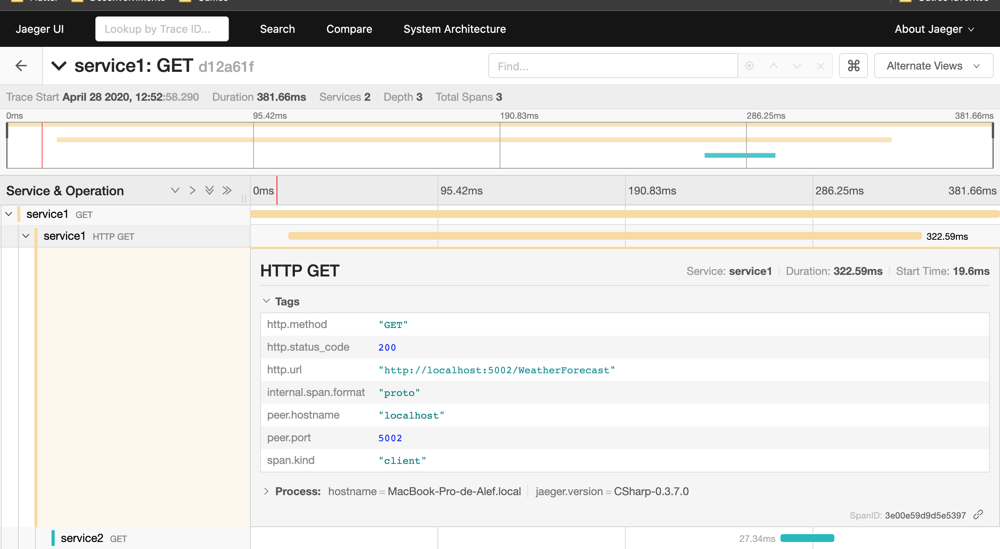

[](https://alefcarlos.visualstudio.com/PlusUltra/_build/latest?definitionId=25&branchName=master)

[](https://www.nuget.org/packages/PlusUltra.OpenTracing.HttpPropagation/)


# PlusUltra.OpenTracing.HttpPropagation

This package basically extracts the OpenTracing context from incoming Http requests and creates child scopes for each outgoing Http request allowing you to easily track the communication to and from your microservices.

## Getting started

Install the package:

```
Install-Package PlusUltra.OpenTracing.HttpPropagation
```

Register on your `ConfigureServices`:

```csharp
services.AddHttpTracingPropagation();
```

### Having an `ITracer` registered

This tool requires you to provide an `ITracer` through dependency injection. If you have not done so already, you can register one like this:

```csharp
services.AddSingleton(serviceProvider =>
{
    var loggerFactory = serviceProvider.GetRequiredService<ILoggerFactory>();
    var senderResolver = new Jaeger.Senders.SenderResolver(loggerFactory);

    Jaeger.Configuration.SenderConfiguration
        .DefaultSenderResolver = senderResolver.RegisterSenderFactory<ThriftSenderFactory>();

    var config = Jaeger.Configuration.FromIConfiguration(loggerFactory, Configuration);

    return config.GetTracer();
});
```

appsettings.json:
```json
{
  "JAEGER_SERVICE_NAME": "service1",
  "JAEGER_SAMPLER_TYPE": "const"
}
```

## Examples



Check out the projects on `examples`.
